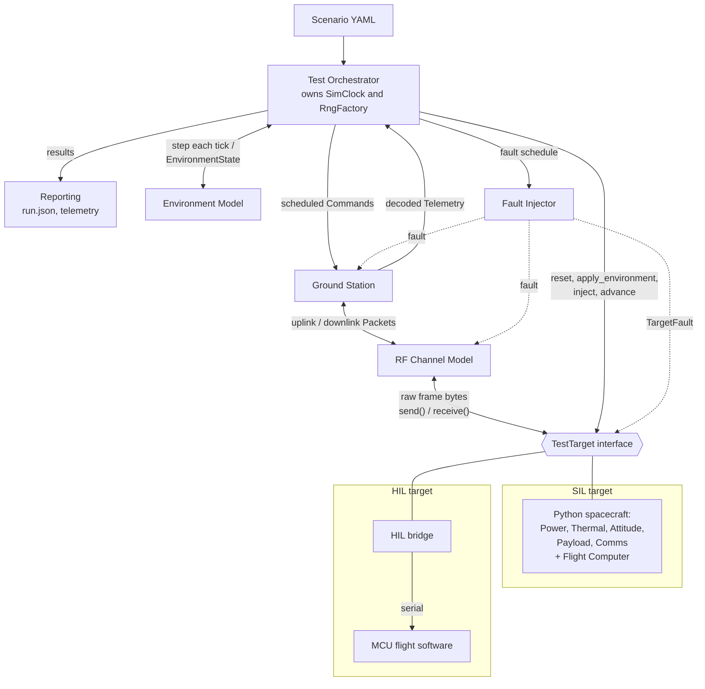

# PocketSat Test Lab

[](https://github.com/solaranoir/pocketsat-testlab/actions/workflows/ci.yml)

A Python Software/Hardware-in-the-Loop (SIL/HIL) test platform for a simulated
spacecraft, a simulated RF channel, and an amateur-radio-style ground station.

## Project goal

Build the **test infrastructure** for a small spacecraft: scenario definition,
orchestration, fault injection, reproducible seeded runs, and reporting. The same
scenario runs unchanged against a Python spacecraft simulation (SIL) or a
microcontroller running flight software (HIL), because the scenario runner only ever
talks to the `TestTarget` interface.

Version 1 covers SIL and MCU HIL, a YAML scenario DSL, reusable fault injection,
seeded test campaigns, and CI.

## Architecture



See [`docs/architecture.md`](docs/architecture.md) for component boundaries, data
flow, and the run lifecycle.

Design decisions are recorded as ADRs in [`docs/adr/`](docs/adr/). The wire format is
described in [`docs/protocol.md`](docs/protocol.md), and the phase plan in
[`docs/roadmap.md`](docs/roadmap.md).

## Development

Requires Python 3.12+ and [uv](https://docs.astral.sh/uv/).

```sh
uv sync
uv run pocketsat --version
uv run ruff check . && uv run ruff format --check . && uv run mypy src && uv run pytest
```

Contributors, human or AI, should read [`AGENTS.md`](AGENTS.md) first.

## License

[Apache License 2.0](LICENSE)
