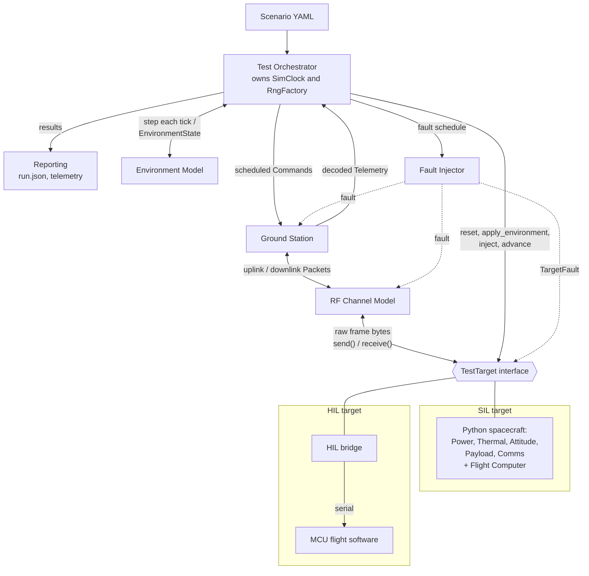

# PocketSat Test Lab

[](https://github.com/solaranoir/pocketsat-testlab/actions/workflows/ci.yml)

A Python Software/Hardware-in-the-Loop (SIL/HIL) test platform for a simulated
spacecraft, a simulated RF channel, and an amateur-radio-style ground station.

## Project goal

Build the **test infrastructure** for a small spacecraft: scenario definition,
orchestration, fault injection, reproducible seeded runs, and reporting. The same
scenario runs unchanged against a Python spacecraft simulation (SIL) or a
microcontroller running flight software (HIL), because the scenario runner only ever
talks to the `TestTarget` interface.

Version 1 covers SIL and MCU HIL, a YAML scenario DSL, reusable fault injection,
seeded test campaigns, and CI.

## Architecture



See [`docs/architecture.md`](docs/architecture.md) for component boundaries, data
flow, and the run lifecycle.

Design decisions are recorded as ADRs in [`docs/adr/`](docs/adr/). The wire format is
described in [`docs/protocol.md`](docs/protocol.md), and the phase plan in
[`docs/roadmap.md`](docs/roadmap.md).

## Development

Requires Python 3.12+ and [uv](https://docs.astral.sh/uv/).

```sh
uv sync
uv run pocketsat --version
uv run ruff check . && uv run ruff format --check . && uv run mypy src && uv run pytest
```

Contributors, human or AI, should read [`AGENTS.md`](AGENTS.md) first.

## Demo

[`scripts/demo_spacecraft.py`](scripts/demo_spacecraft.py) runs the spacecraft subsystem
models (epic #30) together and prints a text report. It takes a few seconds:

```sh
uv run python scripts/demo_spacecraft.py                        # all scenarios
uv run python scripts/demo_spacecraft.py --scenario faults      # one scenario
uv run python scripts/demo_spacecraft.py --orbits 3 --seed 7    # longer nominal run
```

The real power, thermal, attitude, and payload subsystems share a `SnapshotBoard`,
driven by `NominalEnvironment` and a `SimClock`. The scenarios are:

- `nominal`: an orbit's timeline (sunlight and eclipse, true and estimated SOC, bus
  voltage, temperatures, survival heater, attitude, payload buffer) and an energy,
  heater, and flag summary.
- `detumble`: a high starting rate with attitude control off, then on. Generation
  drops while tumbling, and the payload waits for `STABILIZED`.
- `faults`: `battery_drain` (`extra_load_w`) sets `low_battery` and
  `critical_battery` and stops acquisition; `sensor_freeze` (`frozen_sensors`) holds
  the readings while the truth moves.
- `determinism`: the same seed gives identical digests, and a new seed with the
  attitude disturbance off changes only the sensor readings.
- `cold`: a permanent cold eclipse where the survival heater never switches off.

Communications (#44) is a labelled stand-in from `pocketsat.spacecraft.fakes` until
the real subsystem lands.

## License

[Apache License 2.0](LICENSE)
