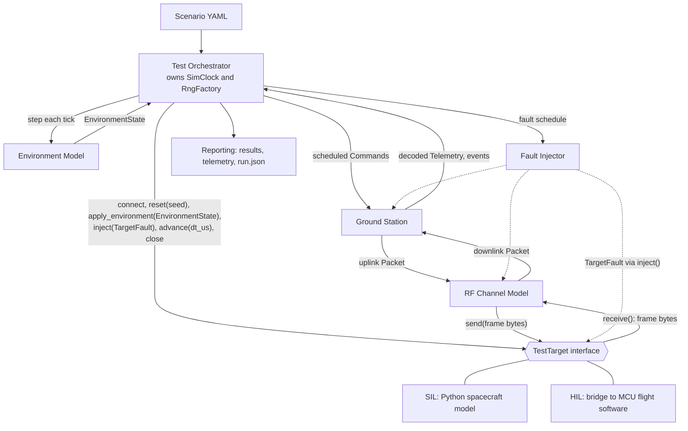
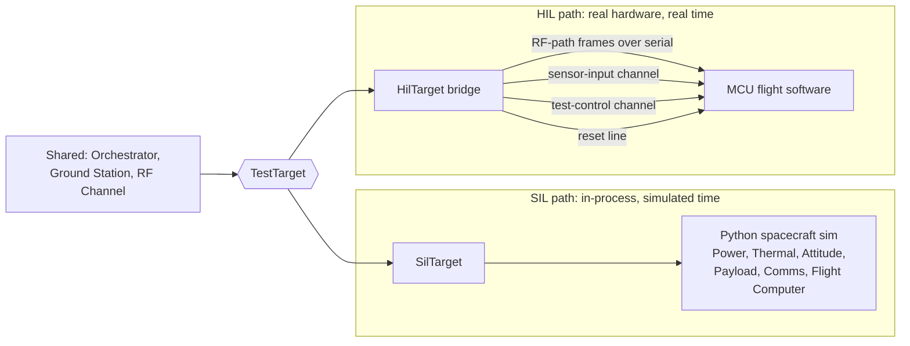
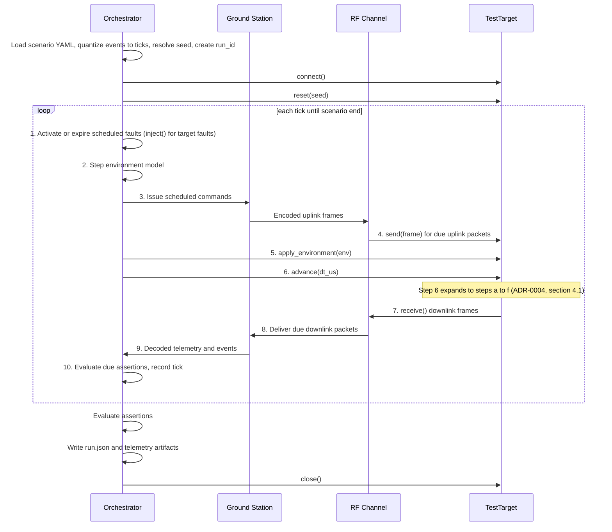

# PocketSat Test Lab — Architecture

Status: Phase 0, reflects ADR-0002 (TestTarget) and ADR-0003 (time and determinism). Decisions marked **(ADR-000N)** are recorded in the named ADR.

## 1. Purpose

PocketSat Test Lab is a SIL/HIL test platform. It executes repeatable mission scenarios against a spacecraft-under-test, over a simulated RF link, through a simulated amateur-radio-style ground station. The spacecraft-under-test is either a Python simulation (SIL) or a microcontroller running flight software (HIL).

The product is the **test infrastructure**: scenario definition, orchestration, fault injection, reproducibility, and reporting.

## 2. Design principles

1. **One scenario, many targets.** Scenarios never know whether the target is SIL or HIL.
2. **Determinism first.** Given the same scenario and seed, a SIL run is bit-for-bit reproducible.
3. **Faults are test inputs.** Packet loss, Doppler error, resets, and outages are reusable, declarative objects.
4. **Messages, not shared state.** Components exchange typed messages across explicit boundaries.
5. **Progressive realism.** Pure simulation first, MCU-backed HIL next, real RF later (v2).

## 3. System overview



Typed messages (`Command`, `Telemetry`, `Packet`, `EnvironmentState`, `TargetFault`) flow between components. Only raw frame bytes cross the TestTarget boundary: the RF channel unwraps a `Packet` to its frame before `send()`, and wraps each frame from `receive()` in a new `Packet`.

The **TestTarget boundary** is the only place where SIL and HIL differ. Everything above it (orchestrator, ground station, RF channel, fault injection, reporting) is shared.

### 3.1 SIL and HIL paths

Below the boundary, the two targets differ only in how they implement `TestTarget`:



| | SIL | HIL |
|---|---|---|
| Spacecraft model | Python subsystems | Firmware on the MCU |
| Environment input | Subsystems read `EnvironmentState` directly | Bridge serializes it onto the sensor-input channel |
| Target faults | Handled inside the simulation | Test-control channel; physical reset line for MCU reset |
| Time | Simulated, instant | Real time, deadline-paced |
| Determinism | Bit-for-bit reproducible | Repeatable, not deterministic |

## 4. Components

| Component | Responsibilities | Explicitly not responsible for |
|---|---|---|
| **Test Orchestrator** | Load scenarios, own the simulated clock and the RNG factory, step the environment model, drive the run loop in the fixed per-tick order, apply the fault schedule, evaluate assertions, record seeds and run IDs, emit results | Spacecraft behavior, RF math, packet decoding, environment physics |
| **Environment Model** | Produce an `EnvironmentState` each tick from the scenario, simulated time, and its seeded random streams: sunlit or eclipse, thermal input, sensor noise or bias, battery-condition overrides | How the spacecraft responds to the environment, RF link effects, delivering state to the target (the orchestrator calls `apply_environment()`) |
| **TestTarget** | Uniform bytes-in/bytes-out interface to the spacecraft-under-test: reset, accept frames, produce frames, accept environment state and target faults, advance time, declare capabilities | Knowing about scenarios, ground station, or RF |
| **SIL target (spacecraft model)** | Python spacecraft model: Power, Thermal, Attitude, Payload, Comms, Flight Computer; modes BOOT, NOMINAL, SCIENCE, DOWNLINK, SAFE, FAULT. Decodes uplink frames, encodes downlink frames, steps instantly on `advance()` | Link quality, pass geometry, generating its own environment |
| **HIL target (bridge)** | Bridge to an MCU over serial/USB: carries RF-path frames, serializes `EnvironmentState` onto the sensor-input channel, delivers faults on the test-control channel or the physical reset line, paces `advance()` in real time, flashing hooks, watchdog observation | Mission logic (that lives in firmware) |
| **MCU flight software (HIL spacecraft)** | Mission logic on real hardware: modes, command handling, telemetry, framing and CRC, watchdog, safe mode, reset recovery; reads sensor inputs and test-control messages from the bridge | Physics and environment (supplied by the bridge), link effects, knowing it is under test beyond the test-control channel |
| **RF Channel Model** | Attach link state to each packet (elevation, range, Doppler, SNR, loss probability, latency); drop, delay, or corrupt packets accordingly | Decoding, spacecraft state |
| **Ground Station** | Pass state (AOS/LOS), radio control, command uplink, packet decoding, station identity, console output | Orbital truth, fault scheduling |
| **Fault Injector** | Apply reusable faults at defined hook points on schedule | Deciding expected behavior (scenarios assert that) |
| **Reporting** | Persist telemetry, logs, per-run results, campaign summaries | Execution |

### 4.1 Spacecraft subsystems (SIL)

Each subsystem of the Python spacecraft model implements the `Subsystem` protocol in `pocketsat.spacecraft.base`: `reset(rng)` with the run's `RngFactory` (subsystems request their own named streams, such as `spacecraft.power.noise`), `step(dt_us, env, controls)` in integer microseconds, and `snapshot()` returning a frozen dataclass. A `SubsystemStack` steps them in one fixed order, defined only in `STEP_ORDER`:

1. **Power**: bus state first; every other subsystem runs on it.
2. **Thermal**: heat from this tick's electrical loads and the environment.
3. **Attitude**: pointing, which the payload and radio depend on.
4. **Payload**: collects data given the current pointing and power.
5. **Comms**: last, so it can transmit what earlier subsystems produced this tick.

The stack's `snapshot()` returns a `SpacecraftState` holding every subsystem's snapshot in that order, for telemetry and for other subsystems to read. Subsystems read each other through a `SnapshotBoard` (#85): the stack publishes each subsystem's snapshot immediately after it steps, so an earlier subsystem is read as of the current tick and a later one as of the previous tick (ADR-0004 §3). A reading subsystem receives the board, as the read-only `SnapshotReader`, when it is constructed; the `Subsystem` protocol is unchanged. See `docs/spacecraft.md`. Changing the order changes recorded behavior and requires a new ADR (ADR-0003 §2).

#### Settings and starting state (ADR-0005)

Each subsystem is built with two records from `pocketsat.spacecraft.config`, and `reset(rng)` returns to them; the `Subsystem` protocol is unchanged.

- **Settings** (`SpacecraftConfig`: `PowerConfig`, `ThermalConfig`, `AttitudeConfig`, `PayloadConfig`, `CommsConfig`) describe what the spacecraft is. `NOMINAL_CONFIG` is the nominal set and `STRESSED_CONFIG` the stressed set, both from the power and thermal budget (#72).
- **Starting state** (`SpacecraftInitialState`: `PowerInitial`, `ThermalInitial`, `AttitudeInitial`, `PayloadInitial`) describes where it starts. Values are validated and are plain values, never random. Communications has no starting record.

Scenarios supply both when the target is created (`SilTarget(config=..., initial=...)`), not through `TestTarget.reset()`, and `reset(seed)` returns to exactly that. Single values can be changed on top of a named set with `dataclasses.replace()`. The flight computer always starts in BOOT. A HIL target that can't honor starting conditions makes such a scenario fail up front.

#### Controls from the flight computer (ADR-0004)

The flight computer commands subsystems through one frozen `SpacecraftControls` record per tick (`pocketsat.spacecraft.controls`), which `SubsystemStack.step` passes to every subsystem. It is built from per-subsystem records plus fault overrides:

| Record or field | Read by | Meaning |
|---|---|---|
| `PayloadControls(enabled, release_through_chunk_id)` | Payload | Acquisition on/off; release stored chunks up to an ID |
| `RadioControls(mode)` | Comms | `OFF`, `RX_ONLY`, or `RX_TX` (full duplex) |
| `AttitudeControls(enabled)` | Attitude | Attitude control on/off |
| `frozen_sensors` | Power, thermal, attitude | Fault override from `sensor_freeze` |
| `extra_load_w` | Power | Fault override from `battery_drain` |

The defaults (payload off, radio `RX_TX`, attitude control on, no overrides) are a test convenience; after a reset, the flight computer's BOOT controls apply to tick 0. Subsystems never read the mode, and each reads only its own record and the overrides that concern it. `SilTarget` merges fault overrides into the controls in one place, with precedence fault > flight computer.

**The flight computer is not part of `STEP_ORDER`.** It always runs after all subsystems. ADR-0003's step 6, `advance(dt_us)`, expands to:

- a. Merge the flight computer's tick N-1 controls with the active fault overrides.
- b. Subsystems step in `STEP_ORDER` with the merged controls.
- c. The flight computer decodes queued uplink, executes commands, and sends ACK/NACK.
- d. The flight computer evaluates flags and state and updates the mode.
- e. The flight computer emits telemetry if due.
- f. The flight computer produces controls for tick N+1.

So commands act one tick later and faults act on the same tick. Telemetry at tick N can show a new mode alongside subsystem state produced under the previous controls; that one-frame lag is correct.

| Chain | Latency (100 ms default tick) |
|---|---|
| Command → ACK | same tick |
| Command → physical effect | +1 tick |
| Effect → power sees the draw | +1 tick (downstream read) |
| Fault → effect | 0 ticks |

**Radio traffic (ADR-0007, Proposed, implemented by #98).** Comms reads nothing, so each tick's radio traffic (bytes sent, uplink frames lost, outbound frames suppressed) reaches it as a `RadioTraffic` record that `SilTarget` places in the controls at step a of the next tick. Comms reports tick N's traffic in tick N+1, and power sees the transmit energy in tick N+2; comms' byte count is therefore named `previous_tick_sent_bytes`. See [ADR-0007](adr/0007-radio-traffic-input-to-comms.md).

#### Snapshot contracts (#76)

Every subsystem's snapshot is defined up front in `pocketsat.spacecraft.snapshots`, so subsystems depend on the contract and not on each other's implementation. Following ADR-0004 §7, each snapshot (`PowerSnapshot`, `ThermalSnapshot`, `AttitudeSnapshot`, `PayloadSnapshot`, `CommsSnapshot`) holds a **truth** record (`PowerTruth`, ...) that physics reads and a **readings** record (`PowerReadings`, ...) that decisions and telemetry read. Payload and comms have no sensors, so their readings always equal their truth. Subsystems read each other only through `SpacecraftState`: one earlier in `STEP_ORDER` as of the current tick, one later as of the previous tick (#36). The fields, the table of cross-subsystem reads, and the shared test fakes (`pocketsat.spacecraft.fakes`) are described in [spacecraft.md](spacecraft.md). A subsystem ticket adds fields only by extending the contract in the same change.

#### Naming and units convention

This convention applies to every record dataclass in `pocketsat`: snapshots, controls, settings and starting state, `EnvironmentState`, and the Phase 0 message types. Existing Phase 0 field names are kept as they are. A test (`tests/unit/test_naming_convention.py`) checks every numeric (`int` or `float`) field of every record dataclass; non-numeric fields (booleans, enums, bytes, strings, collections, nested records) are exempt. Adding a suffix or an allowlist entry means updating this section in the same change.

- **Names** are snake_case and end in a unit suffix:

  | Suffix | Unit |
  |---|---|
  | `_v` | volts |
  | `_a` | amperes |
  | `_w` | watts (power) |
  | `_wh` | watt-hours (energy) |
  | `_c` | degrees Celsius |
  | `_deg` | degrees (angle) |
  | `_dps` | degrees per second |
  | `_bytes` | bytes |
  | `_us` | microseconds |
  | `_ms` | milliseconds |
  | `_s` | seconds |
  | `_km` | kilometres |
  | `_hz` | hertz |
  | `_db` | decibels |

- **Rates** combine a unit with `_per_s` and so end in `_s` (for example `data_rate_bytes_per_s`, bytes per second).
- **Per-degree quantities** combine a unit with `_per_c` and so end in `_c` (#38): `_j_per_c` is joules per °C (a heat capacity, for example `battery_heat_capacity_j_per_c`) and `_w_per_c` is watts per °C (a thermal conductance, for example `battery_conductance_w_per_c`).
- **Numbers without a unit** are IDs (`_id`), counts (`_count`), or on the allowlist:
  - named fractions, kept in 0..1: `soc`, `buffer_fill`, `sensor_noise_scale`, `battery_soc_override`, `loss_probability`, the power flag thresholds `low_battery_soc`, `low_battery_clear_soc`, `critical_battery_soc`, `critical_battery_clear_soc` (#36), and the thermal dissipation split `battery_dissipation_fraction` (#38)
  - existing unitless numbers: `sequence`, `version`, `schema_version`, `master_seed`
- **Fractions** are named for what they are and kept in 0..1 (for example `soc`, `buffer_fill`), never percentages.
- **Flags** are `bool` and live only on readings records. Their names are the `TelemetryFlags` member names (#54): `low_battery`, `critical_battery`, `over_temp`, `under_temp`. The contract owns the names (`READINGS_FLAGS`) and #54's enum matches them; adding a readings flag means reserving a bit in #54's flag table in the same change (in #54's issue text until #54 is implemented, then in `docs/protocol.md`). A boolean that describes equipment rather than a decision (for example `heater_on`, `receiver_on`) is a physical state, not a flag, and may sit on a truth record.
- **States** are `enum.Enum` types defined in the contract (`AttitudeState`, `PayloadState`; the radio mode reuses `RadioMode` from the controls).
- **Power draws** that another subsystem reads are `_w` fields on the truth record.
- **Sign conventions:** battery current is positive when charging; power draws (`_w` loads) are never negative; solar generation is never negative; net battery power is generation minus total load (`PowerTruth.net_power_w`).

## 5. Message types

Typed, immutable messages cross every boundary except the target boundary, which carries raw bytes (see section 6).

- **Command** — ground-originated request (`PING`, `SET_MODE`, `BEGIN_DOWNLINK`, `ENTER_SAFE_MODE`, `RESET`) with ID and payload. Encoded into a frame by the ground station.
- **Telemetry** — timestamped spacecraft state: mode, power, thermal, attitude, payload status, counters. Decoded from a frame by the ground station.
- **Frame** — the encoded wire unit (`bytes`): sync, version, type, sequence, length, payload, CRC-16. The same format is implemented in Python and in MCU firmware. See ADR-0002 and `docs/protocol.md`.
- **Packet** — a frame plus link-state attributes (elevation, range, Doppler, SNR, loss probability, latency) attached by the RF channel. Corruption faults mutate the frame bytes, and the CRC catches them in real code paths.
- **EnvironmentState** — per-tick inputs produced by the orchestrator-side environment model (`pocketsat.environment`): `sunlit` (bool, default `True`), `ambient_temp_c` (default 20.0), `sensor_noise_scale` (multiplier on each subsystem's nominal sensor noise, default 1.0), and `battery_soc_override` (0..1, default `None`). The defaults describe a nominal environment. `NominalEnvironment` produces a repeatable sunlit/eclipse cycle from simulated time, with orbit period and eclipse fraction as parameters. Its ambient temperature is `ambient_temp_c` in sunlight (default 20 °C) and `eclipse_ambient_temp_c` in eclipse (default -20 °C, set by the power and thermal budget, #72), switching exactly at the sunlit/eclipse boundaries. The step change is deliberate: the thermal model's time constant smooths it, and the battery survival heater (#38) cycles during each eclipse.
- **TargetFault** — a fault delivered to the target (type, parameters, duration).

## 6. The TestTarget interface

Defined in ADR-0002, with the `advance` signature amended by ADR-0003:

```python
@dataclass(frozen=True)
class TargetCapabilities:
    deterministic: bool              # SIL True, HIL False
    real_time: bool                  # SIL False, HIL True
    supported_faults: frozenset[str]

class TestTarget(Protocol):
    capabilities: TargetCapabilities

    def connect(self) -> None: ...
    def reset(self, seed: int) -> None: ...
    def send(self, frame: bytes) -> None: ...               # uplink into target
    def receive(self) -> list[bytes]: ...                   # downlink frames produced since last call
    def apply_environment(self, env: EnvironmentState) -> None: ...
    def inject(self, fault: TargetFault) -> None: ...
    def advance(self, dt_us: int) -> None: ...              # integer microseconds (ADR-0003)
    def close(self) -> None: ...
```

Notes:

- **Scope of "target."** The target is the spacecraft side only. The ground station and RF channel are shared infrastructure, which is why the same scenario can run on SIL or HIL.
- **Bytes at the boundary.** The target sees only frames. This keeps HIL honest (it is a wire) and makes byte-level corruption faults meaningful.
- **Environment.** The environment model lives on the orchestrator side. In SIL the subsystems read `EnvironmentState` directly. In HIL the bridge serializes it into sensor-input frames on a dedicated channel to the MCU.
- **Target faults.** Delivered through `inject()`. In HIL they travel over a test-control channel separate from the RF-path command stream, and MCU reset uses a physical reset line. Each target declares supported fault types in `capabilities`; a scenario requesting an unsupported fault fails up front unless the fault is marked `optional`.
- **No receive timeout.** `receive()` drains frames produced so far. In HIL, `advance(dt_us)` waits real time and drains the serial buffer.

## 7. Time and determinism (ADR-0003)

- **Fixed-tick lockstep.** The orchestrator runs a fixed-tick loop. Simulated time is an integer number of microseconds held by a `SimClock`; there is no floating-point time in the simulation. The default tick is 100 ms and is overridable per scenario. Scheduled events are quantized to tick boundaries when a scenario loads.
- **Fixed step order.** Every tick runs the same ten steps in the same order (see section 8). Changing that order changes recorded behavior and requires a new ADR.
- **Named random streams.** Each run has one master seed. Every random consumer (`rf.loss`, `rf.jitter`, `env.sensor_noise`, and so on) requests a named stream from an `RngFactory`, seeded from the master seed and the stream name. Adding a new consumer does not change the values seen by existing ones. Run *i* of a campaign gets its own derived seed, so one failure can be replayed without rerunning the campaign.
- **No wall-clock in the simulation.** Wall-clock time appears only in the run record's metadata (`run_id`, `started_utc`).
- **Portable arithmetic (ADR-0006).** Simulation code uses only operations that IEEE 754 rounds identically everywhere (`+ - * /`, `sqrt`), so results are byte-identical on macOS and Linux. No `math.exp`/`log`/`sin`/`cos`, no float `**`, and no `random.gauss`; noise comes from `portable_normal`, and the clamped cosine from `portable_cos_deg`. The determinism guard test enforces this, and CI runs the suite on both platforms.
- **Run record.** Every run writes a `run.json` containing the scenario name and hash, master and per-stream seeds, tick size, target and capabilities, git SHA with a dirty flag, and a dependency lock hash. A `pocketsat replay run.json` command, planned for Phase 6 and not yet implemented, will rerun a recorded SIL run and check for identical results.
- **SIL vs HIL.** SIL steps the model instantly and is bit-for-bit reproducible. HIL paces each tick against a real-time deadline; it is repeatable but not deterministic, so HIL also logs measured tick jitter and raw serial timestamps.

## 8. Run lifecycle



## 9. Fault injection hook points

| Hook point | Example faults |
|---|---|
| RF channel | Packet loss, corruption, latency, jitter, interference, full outage, frequency offset |
| Ground station | Station failure/restart, Doppler tracking error, stale session |
| Target | MCU reset, radio/transmitter failure, sensor freeze, battery depletion, thermal excursion |

Each fault is a declarative object (type, parameters, start, duration) so it can be scheduled from YAML and reused across scenarios.

## 10. Scenario model (Phase 5 preview)

A scenario declares initial state, pass geometry, scheduled commands, scheduled faults, and assertions, for example:

```yaml
name: low_elevation_pass
target: sil
seed: 42
pass:
  max_elevation_deg: 12
  duration_s: 420
commands:
  - at: 30
    send: PING
faults:
  - type: packet_loss
    at: 100
    duration: 60
    probability: 0.4
assert:
  - telemetry_received_min: 5
  - mode_never: FAULT
```

The schema is formalized in Phase 5. The orchestrator interprets scenarios, so authoring a new test requires no Python.

## 11. Repository mapping

| Component | Package |
|---|---|
| Orchestrator | `pocketsat.orchestrator` |
| TestTarget, SIL, HIL | `pocketsat.targets` |
| Message types (`Command`, `Telemetry`, `Packet`) | `pocketsat.messages` |
| Frame encode/decode, CRC | `pocketsat.frame` |
| `SimClock`, `RngFactory` | `pocketsat.core` |
| Environment model (`NominalEnvironment`) | `pocketsat.environment` |
| Spacecraft model | `pocketsat.spacecraft` |
| Flight computer (modes: [spacecraft-modes.md](spacecraft-modes.md)) | `pocketsat.flight` |
| Ground station | `pocketsat.groundstation` |
| RF channel | `pocketsat.rf` |
| Fault injection | `pocketsat.faults` |
| Scenario DSL | `pocketsat.scenarios` |
| Campaigns | `pocketsat.campaigns` |
| Reporting, run record | `pocketsat.reporting` |

## 12. Decisions

| Question | Status |
|---|---|
| Does the HIL environment/sensor feed live inside `TestTarget` or a separate interface? | Decided in ADR-0002: separate `Environment` model, delivered via `apply_environment()` |
| Packet wire format shared by Python and firmware | Decided in ADR-0002: fixed header, CRC-16/CCITT-FALSE |
| How target-side faults are delivered | Decided in ADR-0002: `inject()` with declared capabilities; HIL uses a test-control channel and a reset line |
| Tick size and scheduling model for the run loop | Decided in ADR-0003: fixed 100 ms default tick, integer microsecond time, fixed ten-step order |
| Run ID and seed record format | Decided in ADR-0003: `run.json` with named, derived seed streams |

## 13. Out of scope for v1

SDR signal path, extensive physical sensors, sophisticated orbital mechanics, real-satellite validation, Kubernetes, anomaly detection. See the [roadmap's scope boundary](roadmap.md#scope-boundary).
