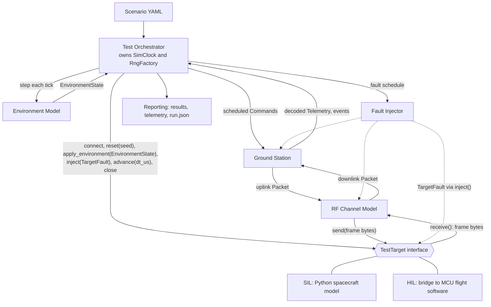
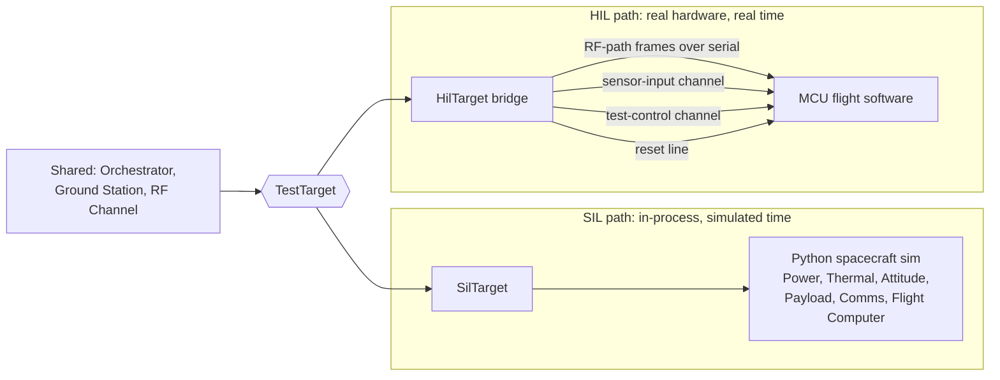
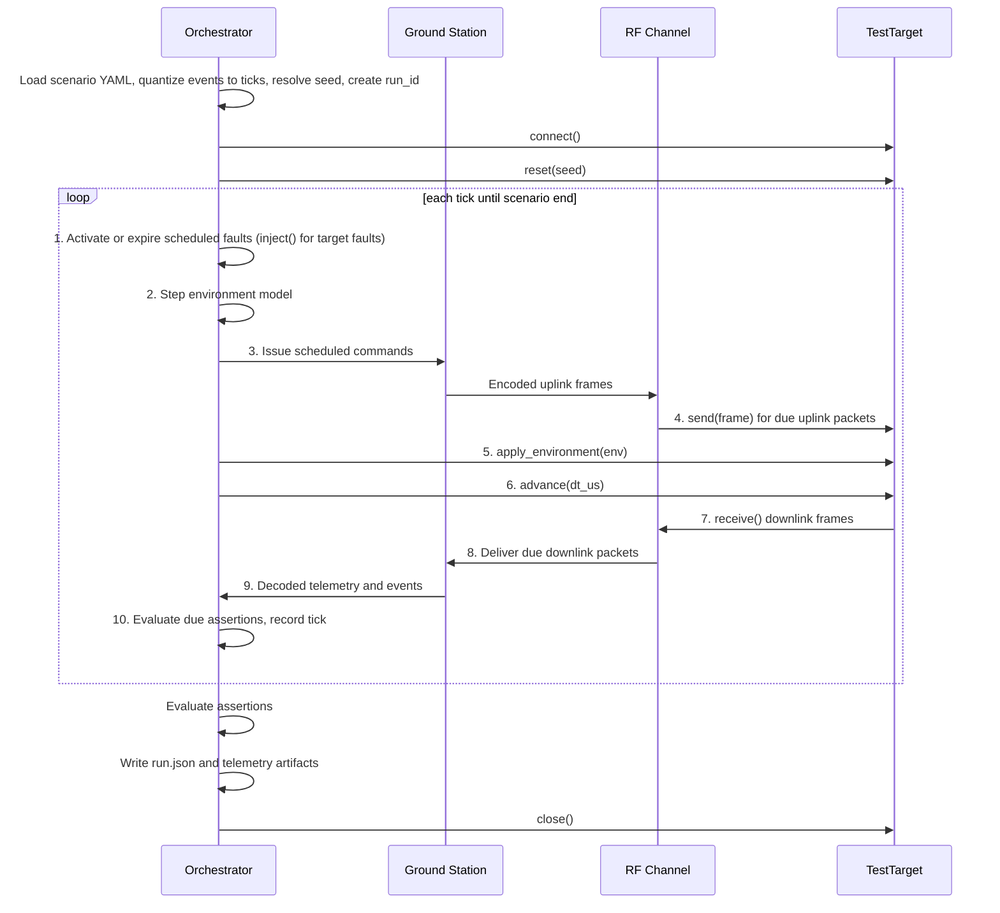

# PocketSat Test Lab — Architecture

Status: Phase 0, reflects ADR-0002 (TestTarget) and ADR-0003 (time and determinism). Decisions marked **(ADR-000N)** are recorded in the named ADR.

## 1. Purpose

PocketSat Test Lab is a SIL/HIL test platform. It executes repeatable mission scenarios against a spacecraft-under-test, over a simulated RF link, through a simulated amateur-radio-style ground station. The spacecraft-under-test is either a Python simulation (SIL) or a microcontroller running flight software (HIL).

The product is the **test infrastructure**: scenario definition, orchestration, fault injection, reproducibility, and reporting.

## 2. Design principles

1. **One scenario, many targets.** Scenarios never know whether the target is SIL or HIL.
2. **Determinism first.** Given the same scenario and seed, a SIL run is bit-for-bit reproducible.
3. **Faults are test inputs.** Packet loss, Doppler error, resets, and outages are reusable, declarative objects.
4. **Messages, not shared state.** Components exchange typed messages across explicit boundaries.
5. **Progressive realism.** Pure simulation first, MCU-backed HIL next, real RF later (v2).

## 3. System overview



Typed messages (`Command`, `Telemetry`, `Packet`, `EnvironmentState`, `TargetFault`) flow between components. Only raw frame bytes cross the TestTarget boundary: the RF channel unwraps a `Packet` to its frame before `send()`, and wraps each frame from `receive()` in a new `Packet`.

The **TestTarget boundary** is the only place where SIL and HIL differ. Everything above it (orchestrator, ground station, RF channel, fault injection, reporting) is shared.

### 3.1 SIL and HIL paths

Below the boundary, the two targets differ only in how they implement `TestTarget`:



| | SIL | HIL |
|---|---|---|
| Spacecraft model | Python subsystems | Firmware on the MCU |
| Environment input | Subsystems read `EnvironmentState` directly | Bridge serializes it onto the sensor-input channel |
| Target faults | Handled inside the simulation | Test-control channel; physical reset line for MCU reset |
| Time | Simulated, instant | Real time, deadline-paced |
| Determinism | Bit-for-bit reproducible | Repeatable, not deterministic |

## 4. Components

| Component | Responsibilities | Explicitly not responsible for |
|---|---|---|
| **Test Orchestrator** | Load scenarios, own the simulated clock and the RNG factory, step the environment model, drive the run loop in the fixed per-tick order, apply the fault schedule, evaluate assertions, record seeds and run IDs, emit results | Spacecraft behavior, RF math, packet decoding, environment physics |
| **Environment Model** | Produce an `EnvironmentState` each tick from the scenario, simulated time, and its seeded random streams: sunlit or eclipse, thermal input, sensor noise or bias, battery-condition overrides | How the spacecraft responds to the environment, RF link effects, delivering state to the target (the orchestrator calls `apply_environment()`) |
| **TestTarget** | Uniform bytes-in/bytes-out interface to the spacecraft-under-test: reset, accept frames, produce frames, accept environment state and target faults, advance time, declare capabilities | Knowing about scenarios, ground station, or RF |
| **SIL target (spacecraft model)** | Python spacecraft model: Power, Thermal, Attitude, Payload, Comms, Flight Computer; modes BOOT, NOMINAL, SCIENCE, DOWNLINK, SAFE, FAULT. Decodes uplink frames, encodes downlink frames, steps instantly on `advance()` | Link quality, pass geometry, generating its own environment |
| **HIL target (bridge)** | Bridge to an MCU over serial/USB: carries RF-path frames, serializes `EnvironmentState` onto the sensor-input channel, delivers faults on the test-control channel or the physical reset line, paces `advance()` in real time, flashing hooks, watchdog observation | Mission logic (that lives in firmware) |
| **MCU flight software (HIL spacecraft)** | Mission logic on real hardware: modes, command handling, telemetry, framing and CRC, watchdog, safe mode, reset recovery; reads sensor inputs and test-control messages from the bridge | Physics and environment (supplied by the bridge), link effects, knowing it is under test beyond the test-control channel |
| **RF Channel Model** | Attach link state to each packet (elevation, range, Doppler, SNR, loss probability, latency); drop, delay, or corrupt packets accordingly | Decoding, spacecraft state |
| **Ground Station** | Pass state (AOS/LOS), radio control, command uplink, packet decoding, station identity, console output | Orbital truth, fault scheduling |
| **Fault Injector** | Apply reusable faults at defined hook points on schedule | Deciding expected behavior (scenarios assert that) |
| **Reporting** | Persist telemetry, logs, per-run results, campaign summaries | Execution |

## 5. Message types

Typed, immutable messages cross every boundary except the target boundary, which carries raw bytes (see section 6).

- **Command** — ground-originated request (`PING`, `SET_MODE`, `BEGIN_DOWNLINK`, `ENTER_SAFE_MODE`, `RESET`) with ID and payload. Encoded into a frame by the ground station.
- **Telemetry** — timestamped spacecraft state: mode, power, thermal, attitude, payload status, counters. Decoded from a frame by the ground station.
- **Frame** — the encoded wire unit (`bytes`): sync, version, type, sequence, length, payload, CRC-16. The same format is implemented in Python and in MCU firmware. See ADR-0002 and `docs/protocol.md`.
- **Packet** — a frame plus link-state attributes (elevation, range, Doppler, SNR, loss probability, latency) attached by the RF channel. Corruption faults mutate the frame bytes, and the CRC catches them in real code paths.
- **EnvironmentState** — per-tick inputs produced by the orchestrator-side environment model (sunlit or eclipse, thermal input, sensor noise or bias, battery-condition overrides).
- **TargetFault** — a fault delivered to the target (type, parameters, duration).

## 6. The TestTarget interface

Defined in ADR-0002, with the `advance` signature amended by ADR-0003:

```python
@dataclass(frozen=True)
class TargetCapabilities:
    deterministic: bool              # SIL True, HIL False
    real_time: bool                  # SIL False, HIL True
    supported_faults: frozenset[str]

class TestTarget(Protocol):
    capabilities: TargetCapabilities

    def connect(self) -> None: ...
    def reset(self, seed: int) -> None: ...
    def send(self, frame: bytes) -> None: ...               # uplink into target
    def receive(self) -> list[bytes]: ...                   # downlink frames produced since last call
    def apply_environment(self, env: EnvironmentState) -> None: ...
    def inject(self, fault: TargetFault) -> None: ...
    def advance(self, dt_us: int) -> None: ...              # integer microseconds (ADR-0003)
    def close(self) -> None: ...
```

Notes:

- **Scope of "target."** The target is the spacecraft side only. The ground station and RF channel are shared infrastructure, which is why the same scenario can run on SIL or HIL.
- **Bytes at the boundary.** The target sees only frames. This keeps HIL honest (it is a wire) and makes byte-level corruption faults meaningful.
- **Environment.** The environment model lives on the orchestrator side. In SIL the subsystems read `EnvironmentState` directly. In HIL the bridge serializes it into sensor-input frames on a dedicated channel to the MCU.
- **Target faults.** Delivered through `inject()`. In HIL they travel over a test-control channel separate from the RF-path command stream, and MCU reset uses a physical reset line. Each target declares supported fault types in `capabilities`; a scenario requesting an unsupported fault fails up front unless the fault is marked `optional`.
- **No receive timeout.** `receive()` drains frames produced so far. In HIL, `advance(dt_us)` waits real time and drains the serial buffer.

## 7. Time and determinism (ADR-0003)

- **Fixed-tick lockstep.** The orchestrator runs a fixed-tick loop. Simulated time is an integer number of microseconds held by a `SimClock`; there is no floating-point time in the simulation. The default tick is 100 ms and is overridable per scenario. Scheduled events are quantized to tick boundaries when a scenario loads.
- **Fixed step order.** Every tick runs the same ten steps in the same order (see section 8). Changing that order changes recorded behavior and requires a new ADR.
- **Named random streams.** Each run has one master seed. Every random consumer (`rf.loss`, `rf.jitter`, `env.sensor_noise`, and so on) requests a named stream from an `RngFactory`, seeded from the master seed and the stream name. Adding a new consumer does not change the values seen by existing ones. Run *i* of a campaign gets its own derived seed, so one failure can be replayed without rerunning the campaign.
- **No wall-clock in the simulation.** Wall-clock time appears only in the run record's metadata (`run_id`, `started_utc`).
- **Run record.** Every run writes a `run.json` containing the scenario name and hash, master and per-stream seeds, tick size, target and capabilities, git SHA with a dirty flag, and a dependency lock hash. A `pocketsat replay run.json` command, planned for Phase 6 and not yet implemented, will rerun a recorded SIL run and check for identical results.
- **SIL vs HIL.** SIL steps the model instantly and is bit-for-bit reproducible. HIL paces each tick against a real-time deadline; it is repeatable but not deterministic, so HIL also logs measured tick jitter and raw serial timestamps.

## 8. Run lifecycle



## 9. Fault injection hook points

| Hook point | Example faults |
|---|---|
| RF channel | Packet loss, corruption, latency, jitter, interference, full outage, frequency offset |
| Ground station | Station failure/restart, Doppler tracking error, stale session |
| Target | MCU reset, radio/transmitter failure, sensor freeze, battery depletion, thermal excursion |

Each fault is a declarative object (type, parameters, start, duration) so it can be scheduled from YAML and reused across scenarios.

## 10. Scenario model (Phase 5 preview)

A scenario declares initial state, pass geometry, scheduled commands, scheduled faults, and assertions, for example:

```yaml
name: low_elevation_pass
target: sil
seed: 42
pass:
  max_elevation_deg: 12
  duration_s: 420
commands:
  - at: 30
    send: PING
faults:
  - type: packet_loss
    at: 100
    duration: 60
    probability: 0.4
assert:
  - telemetry_received_min: 5
  - mode_never: FAULT
```

The schema is formalized in Phase 5. The orchestrator interprets scenarios, so authoring a new test requires no Python.

## 11. Repository mapping

| Component | Package |
|---|---|
| Orchestrator | `pocketsat.orchestrator` |
| TestTarget, SIL, HIL | `pocketsat.targets` |
| Message types (`Command`, `Telemetry`, `Packet`) | `pocketsat.messages` |
| Frame encode/decode, CRC | `pocketsat.frame` |
| `SimClock`, `RngFactory` | `pocketsat.core` |
| Spacecraft model | `pocketsat.spacecraft` |
| Ground station | `pocketsat.groundstation` |
| RF channel | `pocketsat.rf` |
| Fault injection | `pocketsat.faults` |
| Scenario DSL | `pocketsat.scenarios` |
| Campaigns | `pocketsat.campaigns` |
| Reporting, run record | `pocketsat.reporting` |

## 12. Decisions

| Question | Status |
|---|---|
| Does the HIL environment/sensor feed live inside `TestTarget` or a separate interface? | Decided in ADR-0002: separate `Environment` model, delivered via `apply_environment()` |
| Packet wire format shared by Python and firmware | Decided in ADR-0002: fixed header, CRC-16/CCITT-FALSE |
| How target-side faults are delivered | Decided in ADR-0002: `inject()` with declared capabilities; HIL uses a test-control channel and a reset line |
| Tick size and scheduling model for the run loop | Decided in ADR-0003: fixed 100 ms default tick, integer microsecond time, fixed ten-step order |
| Run ID and seed record format | Decided in ADR-0003: `run.json` with named, derived seed streams |

## 13. Out of scope for v1

SDR signal path, extensive physical sensors, sophisticated orbital mechanics, real-satellite validation, Kubernetes, anomaly detection. See the [roadmap's scope boundary](roadmap.md#scope-boundary).
