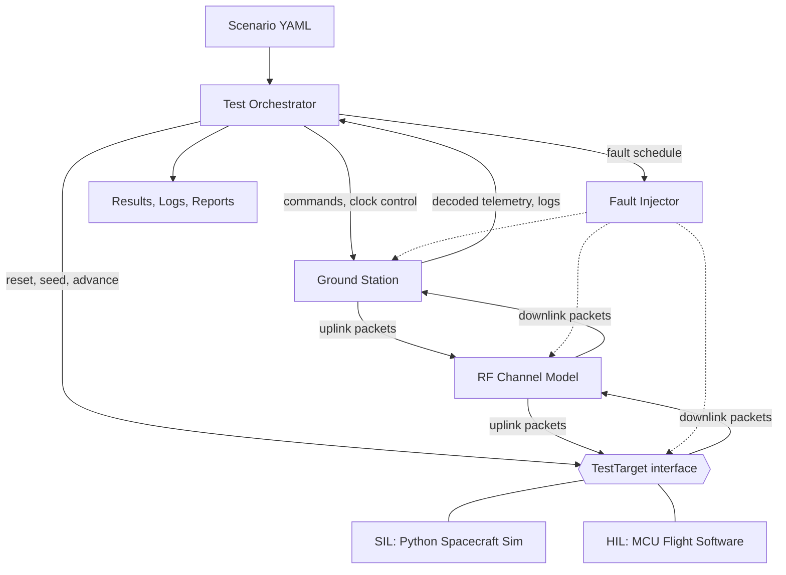
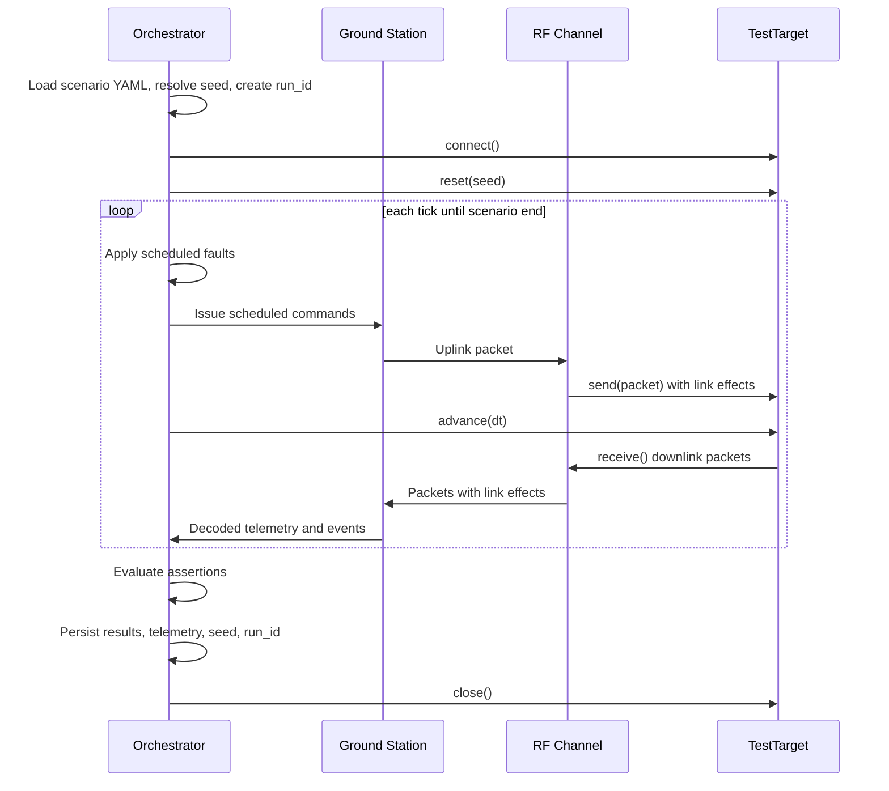

# PocketSat Test Lab — Architecture

Status: Draft for Phase 0. Decisions marked **(ADR-000N)** are to be finalized in the named ADR.

## 1. Purpose

PocketSat Test Lab is a SIL/HIL test platform. It executes repeatable mission scenarios against a spacecraft-under-test, over a simulated RF link, through a simulated amateur-radio-style ground station. The spacecraft-under-test is either a Python simulation (SIL) or a microcontroller running flight software (HIL).

The product is the **test infrastructure**: scenario definition, orchestration, fault injection, reproducibility, and reporting.

## 2. Design principles

1. **One scenario, many targets.** Scenarios never know whether the target is SIL or HIL.
2. **Determinism first.** Given the same scenario and seed, a SIL run is bit-for-bit reproducible.
3. **Faults are test inputs.** Packet loss, Doppler error, resets, and outages are reusable, declarative objects.
4. **Messages, not shared state.** Components exchange typed messages across explicit boundaries.
5. **Progressive realism.** Pure simulation first, MCU-backed HIL next, real RF later (v2).

## 3. System overview



The **TestTarget boundary** is the only place where SIL and HIL differ. Everything above it (orchestrator, ground station, RF channel, fault injection, reporting) is shared.

## 4. Components

| Component | Responsibilities | Explicitly not responsible for |
|---|---|---|
| **Test Orchestrator** | Load scenarios, own the clock, drive the run loop, apply the fault schedule, evaluate assertions, record seeds and run IDs, emit results | Spacecraft behavior, RF math, packet decoding |
| **TestTarget** | Uniform interface to the spacecraft-under-test: reset, accept packets, produce packets, advance time | Knowing about scenarios, ground station, or RF |
| **SIL target** | Python spacecraft model: Power, Thermal, Attitude, Payload, Comms, Flight Computer; modes BOOT, NOMINAL, SCIENCE, DOWNLINK, SAFE, FAULT | Link quality, pass geometry |
| **HIL target** | Bridge to an MCU over serial/USB: framing, flashing hooks, reset control, watchdog observation | Mission logic (that lives in firmware) |
| **RF Channel Model** | Attach link state to each packet (elevation, range, Doppler, SNR, loss probability, latency); drop, delay, or corrupt packets accordingly | Decoding, spacecraft state |
| **Ground Station** | Pass state (AOS/LOS), radio control, command uplink, packet decoding, station identity, console output | Orbital truth, fault scheduling |
| **Fault Injector** | Apply reusable faults at defined hook points on schedule | Deciding expected behavior (scenarios assert that) |
| **Reporting** | Persist telemetry, logs, per-run results, campaign summaries | Execution |

## 5. Message types

Typed, immutable messages cross every boundary.

- **Command** — ground-originated request (`PING`, `SET_MODE`, `BEGIN_DOWNLINK`, `ENTER_SAFE_MODE`, `RESET`) with ID, payload, and sim timestamp.
- **Telemetry** — timestamped spacecraft state: mode, power, thermal, attitude, payload status, counters.
- **Packet** — the on-the-wire unit. Wraps a Command or Telemetry frame, and carries link-state attributes once it passes through the RF channel.

Packets are the contract between ground station, RF channel, and target. A wire format suitable for both Python and MCU firmware (fixed header, length, payload, CRC) is defined in ADR-0002.

## 6. The TestTarget interface

Initial shape (finalized in ADR-0002):

```python
class TestTarget(Protocol):
    def connect(self) -> None: ...
    def reset(self, seed: int) -> None: ...
    def send(self, packet: Packet) -> None: ...            # uplink into the target
    def receive(self, timeout: float) -> list[Packet]: ... # downlink out of the target
    def advance(self, dt: float) -> None: ...              # move target time forward
    def close(self) -> None: ...
```

Notes:

- **Scope of "target."** The target is the spacecraft side only. The ground station and RF channel are shared infrastructure, which is why the same scenario can run on SIL or HIL.
- **HIL environment feed.** In HIL, the MCU hosts flight software, while environment and sensor models (battery, temperature, attitude inputs) may remain in Python and be fed to the MCU. Whether that feed is part of `TestTarget` or a separate `Environment` interface is an open question for ADR-0002.
- **Fault hooks.** Target-side faults (MCU reset, sensor freeze, radio reset) reach the target through a defined fault-hook method or a control command, not by reaching into internals. The exact mechanism is decided in ADR-0002.

## 7. Time and determinism (ADR-0003)

- The orchestrator owns a **simulated clock**. No simulation code reads wall-clock time.
- **SIL:** `advance(dt)` steps the model instantly. Runs are fast and reproducible.
- **HIL:** the MCU runs in real time, so `advance(dt)` blocks for `dt` of real time. HIL runs are repeatable but not bit-for-bit deterministic, and the docs say so plainly.
- Randomness comes from injected, seeded generators. Every run records `scenario`, `seed`, `run_id`, and code version, so any failure can be replayed.

## 8. Run lifecycle



## 9. Fault injection hook points

| Hook point | Example faults |
|---|---|
| RF channel | Packet loss, corruption, latency, jitter, interference, full outage, frequency offset |
| Ground station | Station failure/restart, Doppler tracking error, stale session |
| Target | MCU reset, radio/transmitter failure, sensor freeze, battery depletion, thermal excursion |

Each fault is a declarative object (type, parameters, start, duration) so it can be scheduled from YAML and reused across scenarios.

## 10. Scenario model (Phase 5 preview)

A scenario declares initial state, pass geometry, scheduled commands, scheduled faults, and assertions, for example:

```yaml
name: low_elevation_pass
target: sil
seed: 42
pass:
  max_elevation_deg: 12
  duration_s: 420
commands:
  - at: 30
    send: PING
faults:
  - type: packet_loss
    at: 100
    duration: 60
    probability: 0.4
assert:
  - telemetry_received_min: 5
  - mode_never: FAULT
```

The schema is formalized in Phase 5. The orchestrator interprets scenarios, so authoring a new test requires no Python.

## 11. Repository mapping

| Component | Package |
|---|---|
| Orchestrator | `pocketsat.orchestrator` |
| TestTarget, SIL, HIL | `pocketsat.targets` |
| Spacecraft model | `pocketsat.spacecraft` |
| Ground station | `pocketsat.groundstation` |
| RF channel | `pocketsat.rf` |
| Fault injection | `pocketsat.faults` |
| Scenario DSL | `pocketsat.scenarios` |
| Campaigns | `pocketsat.campaigns` |
| Reporting | `pocketsat.reporting` |

## 12. Open decisions

| Question | Resolved in |
|---|---|
| Does the HIL environment/sensor feed live inside `TestTarget` or a separate interface? | ADR-0002 |
| Packet wire format shared by Python and firmware | ADR-0002 |
| How target-side faults are delivered (hook method vs control command) | ADR-0002 |
| Tick size and scheduling model for the run loop | ADR-0003 |
| Run ID and seed record format | ADR-0003 |

## 13. Out of scope for v1

SDR signal path, extensive physical sensors, sophisticated orbital mechanics, real-satellite validation, Kubernetes, anomaly detection. See the roadmap's scope boundary.
