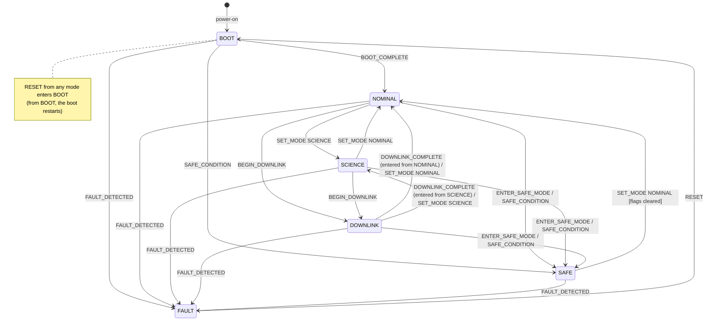

# Spacecraft modes

The flight computer's mode state machine (#47): the six modes, the events that move between them, the transition table, the reason codes for rejected commands, and the controls each mode produces. The code is `pocketsat.flight.modes` (exported from `pocketsat.flight`). Tests in `tests/unit/test_modes.py` check every (mode, event) pair and check that the tables on this page match the code.

The flight computer is part of the SIL spacecraft model but is not in `STEP_ORDER`. It runs after every subsystem each tick (ADR-0004 §2, steps c to f): commands are handled in step c, the mode is updated in step d, and step f produces the controls for the next tick from the new mode.

## Modes

| Mode | Purpose | Left by |
|---|---|---|
| BOOT | Power-on and after RESET (ADR-0005 §5). Only RESET (and PING, #51) are accepted. | `BOOT_COMPLETE` (#49), `SAFE_CONDITION`, `FAULT_DETECTED`, RESET |
| NOMINAL | Housekeeping. Payload off. | Commands, `SAFE_CONDITION`, `FAULT_DETECTED` |
| SCIENCE | Payload acquiring. | Commands, `SAFE_CONDITION`, `FAULT_DETECTED` |
| DOWNLINK | Sending stored payload data (#56). Returns to the mode it was entered from. | `DOWNLINK_COMPLETE`, commands, `SAFE_CONDITION`, `FAULT_DETECTED` |
| SAFE | Survival: payload off, sun-safe attitude control, radio on so the ground can recover the spacecraft. | SET_MODE NOMINAL once the triggering flags have cleared (#48), RESET, `FAULT_DETECTED` |
| FAULT | Internal consistency failure (#48). | RESET only |

`Mode` is an `IntEnum`. Its values are the wire encoding: telemetry (#54) carries the mode as a uint8, and the `SET_MODE` argument (#52) uses the same numbers. They are part of the firmware contract and are never renumbered or reused.

<!-- mode-values:start -->
| Value | Mode |
|---|---|
| 0 | BOOT |
| 1 | NOMINAL |
| 2 | SCIENCE |
| 3 | DOWNLINK |
| 4 | SAFE |
| 5 | FAULT |
<!-- mode-values:end -->

## Events

The state machine consumes one `ModeEvent` at a time through `transition(state, event, *, safe_exit_allowed)`. **It defines the events but does not generate them**; each comes from the ticket that owns the rule:

| Event | Kind | Generated by |
|---|---|---|
| `SET_MODE` (with a target mode) | command | Command dispatcher (#51), after payload decoding and argument validation (#52) |
| `BEGIN_DOWNLINK` | command | #51 |
| `ENTER_SAFE_MODE` | command | #51 |
| `RESET` | command | #51, and the `forced_reset` fault (#60) through the same path (ADR-0004 §9). The reboot itself (uptime, boot counter, transient state, held-in-reset period) is #49 |
| `BOOT_COMPLETE` | automatic | Boot sequence, after the configured boot duration (#49) |
| `SAFE_CONDITION` | automatic | Safe-mode rules: `critical_battery`, `over_temp`, or `under_temp` sustained for the configured number of ticks, judged from reported values (#48) |
| `FAULT_DETECTED` | automatic | Fault rules: an internal consistency failure (#48) |
| `DOWNLINK_COMPLETE` | automatic | Downlink session: no unsent chunks remain (#56) |

The `safe_exit_allowed` input is the guard for leaving SAFE: whether the flags that put the spacecraft in SAFE have cleared. #48 computes it. It is a required argument, so no caller can leave SAFE by forgetting it; it is read only for SET_MODE NOMINAL in SAFE.

PING is not a mode event: it never changes the mode, and #51 answers it in every mode.

There is no separate "downlink aborted" event. A session ends early whenever DOWNLINK is left by any other event (SET_MODE, ENTER_SAFE_MODE, `SAFE_CONDITION`, `FAULT_DETECTED`, RESET); unreleased chunks stay in the payload buffer and the next session resumes from the oldest one (#56).

## Transition table

Each cell is the result of an event (row) in a mode (column):

- **→ MODE**: the mode is entered (outcome `TRANSITION`). Its controls apply from the next tick. A command gets an ACK. RESET in BOOT re-enters BOOT, so the boot restarts.
- **ACK, no change**: a command asking for what is already true (outcome `NO_CHANGE`). Accepted, so a ground retry after a lost ACK succeeds instead of being NACKed. BEGIN_DOWNLINK during DOWNLINK does not restart the session.
- **NACK reason**: a command that is not allowed (outcome `REJECTED`), with the reason code for the NACK payload.
- **ignored**: an automatic event with no effect in this mode (outcome `IGNORED`). Nothing is sent. Only commands are ever rejected, and commands are never ignored.
- **→ return mode**: back to the mode DOWNLINK was entered from (NOMINAL or SCIENCE).

<!-- transition-table:start -->
| Event | BOOT | NOMINAL | SCIENCE | DOWNLINK | SAFE | FAULT |
|---|---|---|---|---|---|---|
| SET_MODE BOOT | NACK BOOT_IN_PROGRESS | NACK TARGET_NOT_COMMANDABLE | NACK TARGET_NOT_COMMANDABLE | NACK TARGET_NOT_COMMANDABLE | NACK TARGET_NOT_COMMANDABLE | NACK FAULT_REQUIRES_RESET |
| SET_MODE NOMINAL | NACK BOOT_IN_PROGRESS | ACK, no change | → NOMINAL | → NOMINAL | → NOMINAL if flags cleared, else NACK SAFE_CONDITIONS_ACTIVE | NACK FAULT_REQUIRES_RESET |
| SET_MODE SCIENCE | NACK BOOT_IN_PROGRESS | → SCIENCE | ACK, no change | → SCIENCE | NACK NOT_ALLOWED_IN_SAFE | NACK FAULT_REQUIRES_RESET |
| SET_MODE DOWNLINK | NACK BOOT_IN_PROGRESS | NACK TARGET_NOT_COMMANDABLE | NACK TARGET_NOT_COMMANDABLE | NACK TARGET_NOT_COMMANDABLE | NACK TARGET_NOT_COMMANDABLE | NACK FAULT_REQUIRES_RESET |
| SET_MODE SAFE | NACK BOOT_IN_PROGRESS | NACK TARGET_NOT_COMMANDABLE | NACK TARGET_NOT_COMMANDABLE | NACK TARGET_NOT_COMMANDABLE | NACK TARGET_NOT_COMMANDABLE | NACK FAULT_REQUIRES_RESET |
| SET_MODE FAULT | NACK BOOT_IN_PROGRESS | NACK TARGET_NOT_COMMANDABLE | NACK TARGET_NOT_COMMANDABLE | NACK TARGET_NOT_COMMANDABLE | NACK TARGET_NOT_COMMANDABLE | NACK FAULT_REQUIRES_RESET |
| BEGIN_DOWNLINK | NACK BOOT_IN_PROGRESS | → DOWNLINK | → DOWNLINK | ACK, no change | NACK NOT_ALLOWED_IN_SAFE | NACK FAULT_REQUIRES_RESET |
| ENTER_SAFE_MODE | NACK BOOT_IN_PROGRESS | → SAFE | → SAFE | → SAFE | ACK, no change | NACK FAULT_REQUIRES_RESET |
| RESET | → BOOT | → BOOT | → BOOT | → BOOT | → BOOT | → BOOT |
| BOOT_COMPLETE | → NOMINAL | ignored | ignored | ignored | ignored | ignored |
| SAFE_CONDITION | → SAFE | → SAFE | → SAFE | → SAFE | ignored | ignored |
| FAULT_DETECTED | → FAULT | → FAULT | → FAULT | → FAULT | → FAULT | ignored |
| DOWNLINK_COMPLETE | ignored | ignored | ignored | → return mode | ignored | ignored |
<!-- transition-table:end -->

The rules are checked in a fixed order, so a rejected command gets the first reason that applies:

1. RESET always enters BOOT.
2. `FAULT_DETECTED` enters FAULT from every other mode.
3. In FAULT, everything else is rejected with `FAULT_REQUIRES_RESET` (commands) or ignored.
4. `SAFE_CONDITION` enters SAFE from every other mode, BOOT included.
5. In BOOT, `BOOT_COMPLETE` enters NOMINAL and every other command is rejected with `BOOT_IN_PROGRESS` (#51: only RESET and PING are handled during BOOT).
6. SET_MODE to anything but NOMINAL or SCIENCE is rejected with `TARGET_NOT_COMMANDABLE`.
7. The per-mode rules for NOMINAL, SCIENCE, DOWNLINK, and SAFE in the table.

## Reason codes

A rejected command's NACK carries a uint8 reason code (#51). The mode reasons use 0x10 to 0x1F. 0x00 is reserved and never sent, and 0x01 to 0x0F are left for #52's decoding and argument errors (unknown command, truncated payload, invalid argument, for example a SET_MODE byte that is not a mode at all). `docs/protocol.md` will list every code (#52). Codes are never renumbered or reused.

<!-- reason-codes:start -->
| Code | Reason |
|---|---|
| 0x10 | BOOT_IN_PROGRESS |
| 0x11 | FAULT_REQUIRES_RESET |
| 0x12 | NOT_ALLOWED_IN_SAFE |
| 0x13 | SAFE_CONDITIONS_ACTIVE |
| 0x14 | TARGET_NOT_COMMANDABLE |
<!-- reason-codes:end -->

- `BOOT_IN_PROGRESS`: in BOOT only RESET (and PING) are accepted.
- `FAULT_REQUIRES_RESET`: in FAULT only RESET is accepted.
- `NOT_ALLOWED_IN_SAFE`: from SAFE the way up is SET_MODE NOMINAL first; SCIENCE and BEGIN_DOWNLINK are refused until then.
- `SAFE_CONDITIONS_ACTIVE`: SET_MODE NOMINAL from SAFE while the triggering flags have not cleared (#48).
- `TARGET_NOT_COMMANDABLE`: SET_MODE asked for BOOT, DOWNLINK, SAFE, or FAULT. Use RESET, BEGIN_DOWNLINK, or ENTER_SAFE_MODE; FAULT is never commanded.

## Mode to controls

Each mode's entry action is one `SpacecraftControls` record, returned by `controls_for_mode(mode)`, the single controls function of ADR-0004 §14. The flight computer calls it in step f with the mode after step d, and the controls apply from the next tick. There are no other entry or exit actions. `reset()` applies BOOT's controls to tick 0 (ADR-0004 §2).

<!-- mode-controls:start -->
| Mode | Payload | Radio | Attitude control |
|---|---|---|---|
| BOOT | off | RX_TX | off |
| NOMINAL | off | RX_TX | on |
| SCIENCE | enabled | RX_TX | on |
| DOWNLINK | off | RX_TX | on |
| SAFE | off | RX_TX | on |
| FAULT | off | RX_TX | on |
<!-- mode-controls:end -->

- **Radio `RX_TX` in every mode**, so beacons, telemetry, and ACK/NACK can always go out (ADR-0004 §10). `RX_ONLY` and `OFF` exist but are unused by default:
  - With the transmitter's idle draw at 0.15 W (#72, "Option C"), there is no energy case for turning it off; transmit energy follows the bytes actually sent.
  - `RX_ONLY` would hide the spacecraft's state from the ground exactly when it matters (SAFE, FAULT) and would turn every command into a silent one.
  - `OFF` would also stop the receiver, so the RESET command could never arrive.
  - The `transmitter_off` fault still disables the transmitter as an override merged by `SilTarget` (#59, #60). A later mode or rule that sheds the transmitter (for example a power emergency below `critical_battery`) would use `RX_ONLY` here.
- **Attitude control on in every mode except BOOT** (BOOT's controls are #49's: payload off, `RX_TX` so the boot-complete beacon can go out, attitude control off). SAFE keeps it on so the arrays stay sun-pointed and the spacecraft recovers rather than tumbles; a tumbling orbit generates about a third of the power (#72's tumbling case).
- **Payload enabled only in SCIENCE.** In DOWNLINK it is off (see below).
- **FAULT uses SAFE's controls.** FAULT means the flight software has found itself inconsistent, so it falls back to the survival configuration: payload off, attitude control on (sun-safe pointing keeps the battery charging while the ground diagnoses), radio `RX_TX` so the ground sees FAULT in telemetry, gets NACKs that say `FAULT_REQUIRES_RESET`, and can send RESET. FAULT differs from SAFE only in how it is left.
- **No fault overrides and no chunk release.** `frozen_sensors` is empty and `extra_load_w` is 0; `SilTarget` merges fault overrides (#59). `release_through_chunk_id` is always `None` here; the downlink session (#56) adds it by extending this function, so controls still come from one function.

### Payload during DOWNLINK: off

The payload is off in DOWNLINK, so each mode does one job and the controls depend on the mode alone. The power and thermal budget (#72) assumed it stays on, which is pessimistic. With it off:

- **Energy:** the 10-minute pass no longer carries the 1.5 W acquiring draw, about 0.25 Wh per orbit, which lifts the reference profile's orbit-average margin from about +12.8% to about +16% (roughly +3 percentage points, still inside the +5% to +25% band).
- **Data:** about 24 kB less per orbit is produced (600 s at 40 B/s), so the data margin rises from about 36% to about 43%.
- **Cost:** about 11% less science time (10 of 92 minutes) in the reference profile.

Keeping it on would instead keep science continuous through passes and match the budget's calibrated numbers exactly. That is a one-row change in `controls_for_mode` and in the table above.

## What other tickets add

| Ticket | Adds |
|---|---|
| #101 | The `FlightComputer` component that holds a `ModeState`, calls `transition()` in step d, and `controls_for_mode()` in step f |
| #48 | The rules that raise `SAFE_CONDITION` and `FAULT_DETECTED`, and the `safe_exit_allowed` guard (flags cleared) |
| #49 | When `BOOT_COMPLETE` fires, the reboot behind RESET and `forced_reset` (uptime, boot counter, held-in-reset), and BOOT's controls applying from tick 0 |
| #51, #52 | Decoding commands into events, ACK/NACK frames carrying the reason codes, PING, and the decoding reason codes in 0x01 to 0x0F |
| #55 | Telemetry cadence per mode |
| #56 | The downlink session: raising `DOWNLINK_COMPLETE`, setting `release_through_chunk_id`, and resuming after an early exit |
| #59 | Merging fault overrides into these controls and applying BOOT's controls at `reset(seed)` |
